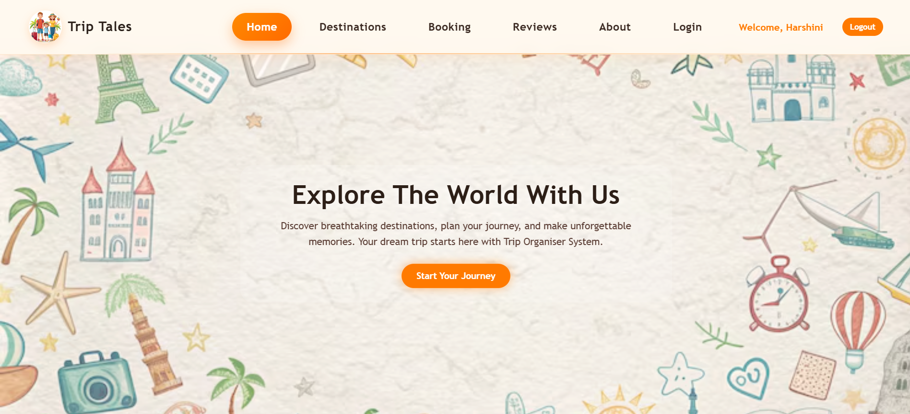
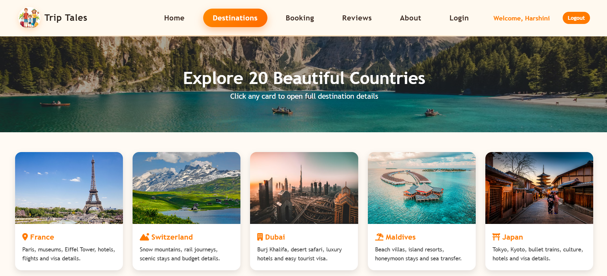
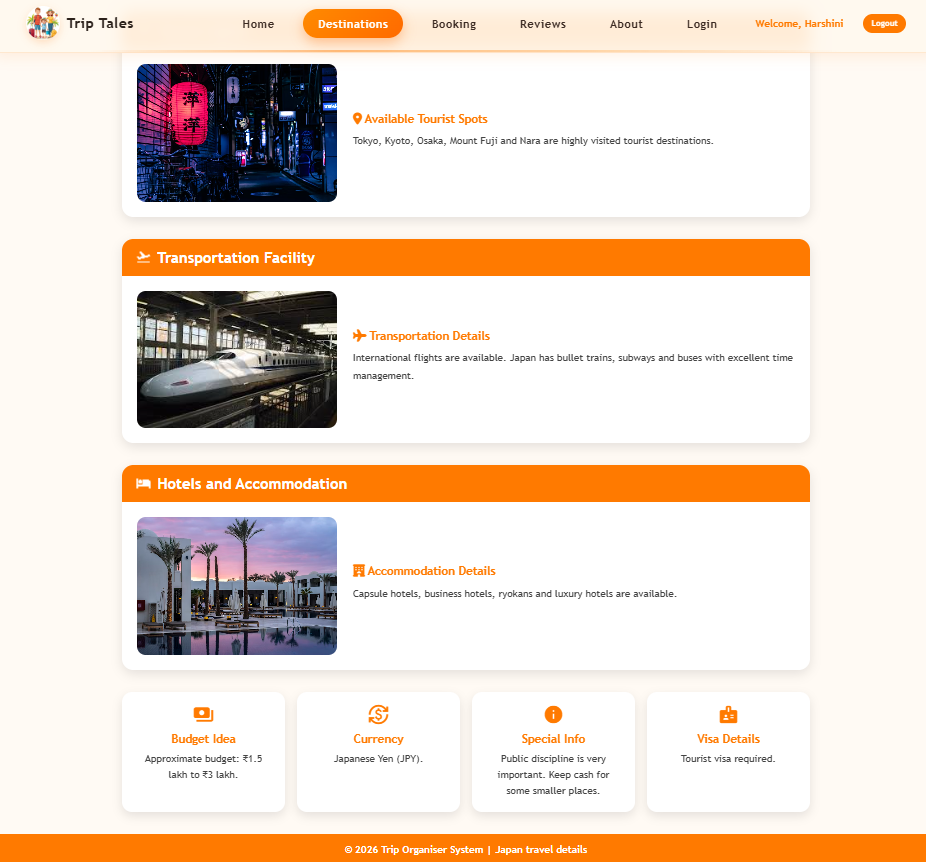
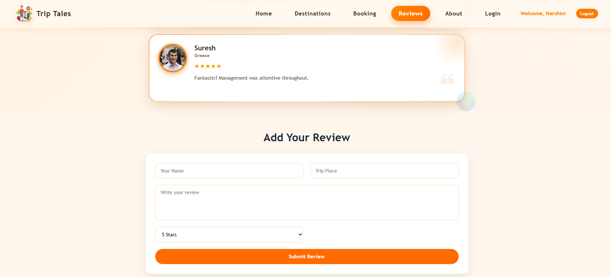
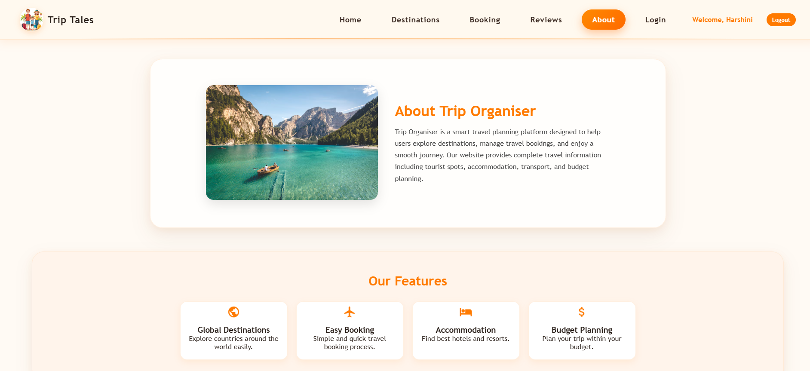
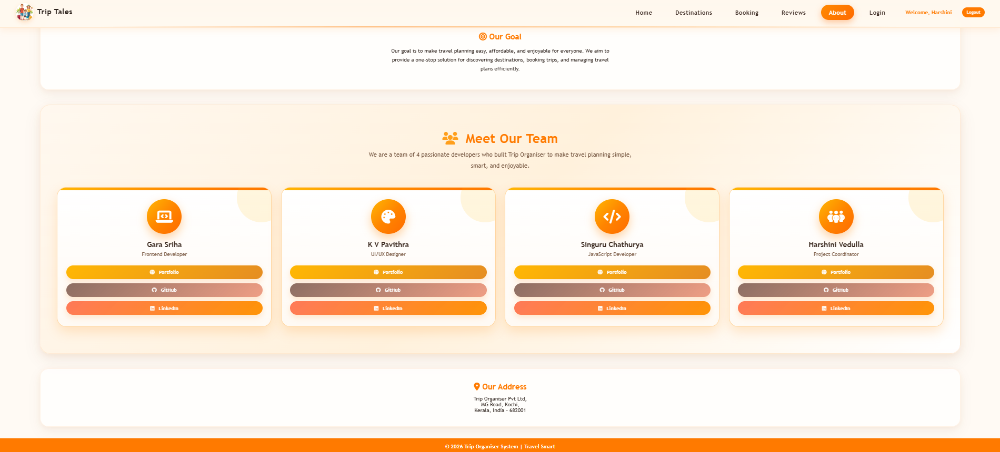
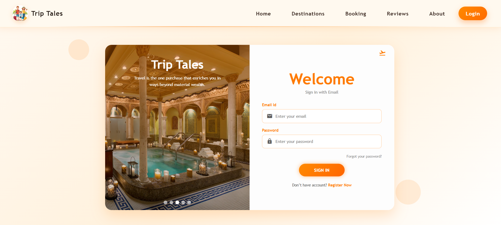

# 🌍 Trip Tales - Trip Organiser System

## 📌 Project Overview

**Trip Tales** is a frontend-based **Trip Organiser System** designed to help users explore travel destinations, view country-wise travel information, book trips, read reviews, and access travel-related details in a simple and user-friendly way.

This project is developed using **HTML, CSS, and JavaScript**. It also includes additional libraries and modern frontend technologies such as **AOS animations, custom CSS animations, SweetAlert, React.js, and localStorage** to improve design, interactivity, and user experience.

---

## ✨ Key Features

- 🏠 Attractive home page with travel theme
- 🌎 Destination cards with country information
- 📍 Country details page with tourist spots, transport, and accommodation details
- 🧾 Booking page with form-based user input
- ⭐ Reviews page with React-based dynamic review system
- 🔐 Login and logout functionality
- 💾 localStorage for storing user and review data
- 🎨 Responsive and visually appealing CSS design
- 🎬 AOS scroll animations and custom CSS animations
- 🔔 SweetAlert popups for better alert messages
- 🧭 Smooth navigation between pages

---

## 🧩 Website Modules

### 🏠 1. Home Page

The Home page acts as the landing page of the website. It introduces users to the Trip Organiser System and provides quick navigation to other sections.

**Features:**
- Hero section
- Website introduction
- Navigation bar
- Call-to-action button
- Feature cards

---

### 🌎 2. Destinations Page

The Destinations page displays multiple country cards with images and short travel descriptions.

**Features:**
- Country cards
- Destination images
- Short descriptions
- Links to country details page

---

### 📍 3. Country Details Page

The Country Details page provides detailed information about selected countries.

**Features:**
- Country overview
- Tourist spots
- Transport details
- Accommodation details
- Country-specific images

---

### 🧾 4. Booking Page

The Booking page allows users to enter travel booking details through a form.

**Features:**
- Booking form
- User input fields
- JavaScript validation
- Interactive form handling

---

### ⭐ 5. Reviews Page

The Reviews page displays user reviews and includes a React.js-based dynamic review system.

**Features:**
- Existing review cards
- Add new reviews
- Delete reviews
- React state management
- localStorage review saving


---

### ℹ️ 6. About Page

The About page explains the purpose of the Trip Organiser System and provides project and team information.

**Features:**
- About section
- Project goal
- Features section
- Team details
- Address/contact section



---

### 🔐 7. Login Page

The Login page allows users to log in and stores login details using localStorage.

**Features:**
- Login form
- User authentication simulation
- localStorage usage
- Logout functionality

---

## 🛠️ Technologies Used

| Technology | Purpose |
|---|---|
| 🧱 HTML | Structure of web pages |
| 🎨 CSS | Styling, layout, and responsive design |
| ⚙️ JavaScript | Interactivity and dynamic behavior |
| ⚛️ React.js | Dynamic review system |
| 💾 localStorage | Storing login and review data |
| 🎬 AOS | Scroll-based animations |
| ✨ Custom CSS Animations | Hover, fade, slide, pulse effects |
| 🔔 SweetAlert2 | Stylish alert popups |
| ⭐ Font Awesome | Icons |
| 🔤 Google Fonts | Typography |
| 🎯 Material Icons | Additional icons |

---

## 🎬 Animations Used

This project includes **two types of animations**:

### 1. AOS Scroll Animations

AOS animations are used to animate elements when the user scrolls through the website.

Examples:
- Fade-up
- Fade-down
- Fade-left
- Fade-right
- Zoom-in

### 2. Custom CSS Animations

Custom CSS animations are used to improve the visual appearance of the website.

Examples:
- Slide-down animation
- Fade-in animation
- Hover-lift effect
- Pulse button effect
- Floating icon effect

---

## ⚛️ React.js Implementation

React.js is implemented in the **Reviews Page** to create a dynamic and interactive review system.

### React Features Used

- React components
- `useState()`
- `useEffect()`
- Event handling
- Dynamic rendering using `map()`
- Add review functionality
- Delete review functionality
- localStorage integration

### Review System Functionality

Users can:
- Enter their name
- Enter trip place
- Write a review
- Select rating
- Submit review
- Delete review

The reviews are saved in **localStorage**, so they remain available even after refreshing the page.

---

## 💾 LocalStorage Usage

localStorage is used in two important parts of the project:

### 🔐 Login System

- Stores logged-in user details
- Displays logged-in user information
- Supports logout functionality

### ⭐ Review System

- Stores user-added reviews
- Keeps reviews after page refresh
- Allows deleting saved reviews

---

---

## 👥 Team Members and Contributions

| Member | Role | Contribution |
|---|---|---|
| **Sriha Gara** | Frontend Developer | Home and About Module Development |
| **K V Pavithra** | Frontend Developer | Destinations and Country Information Module Development |
| **Singuru Chathurya** | Frontend Developer | Booking and Authentication Module Development |
| **Harshini Vedulla** | Frontend Developer | Reviews and User Interaction Module Development |

---

## 📁 Project Folder Structure

```text
Trip-Tales
│
├── index.html
│
├── pages
│   ├── about.html
│   ├── country.html
│   ├── destinations.html
│   ├── login.html
│   ├── online.html
│   └── reviews.html
│
├── css
│   ├── about.css
│   ├── country.css
│   ├── destinations.css
│   ├── index.css
│   ├── login.css
│   ├── online.css
│   └── reviews.css
│
├── js
│   ├── auth.js
│   ├── login.js
│   └── online.js
│
├── libraries
│   ├── animations.css
│   └── reviews-react.js
│
├── images
│   ├── accommodation
│   ├── country
│   ├── spot
│   ├── transport
│   └── logo.png
│
├── Screenshots
│   ├── About-1.png
│   ├── About-2.png
│   ├── Country.png
│   ├── Destinations.png
│   ├── Home.png
│   ├── Login.png
│   ├── Online Booking.png
│   └── Reviews.png
│
└── README.md
